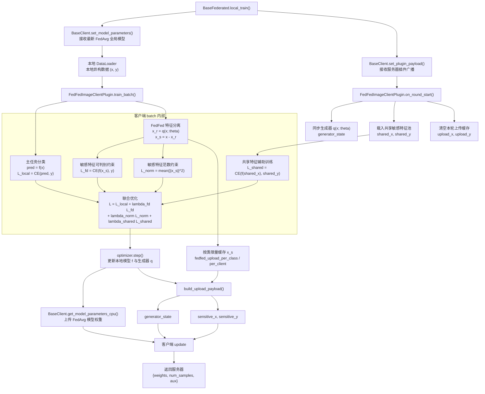
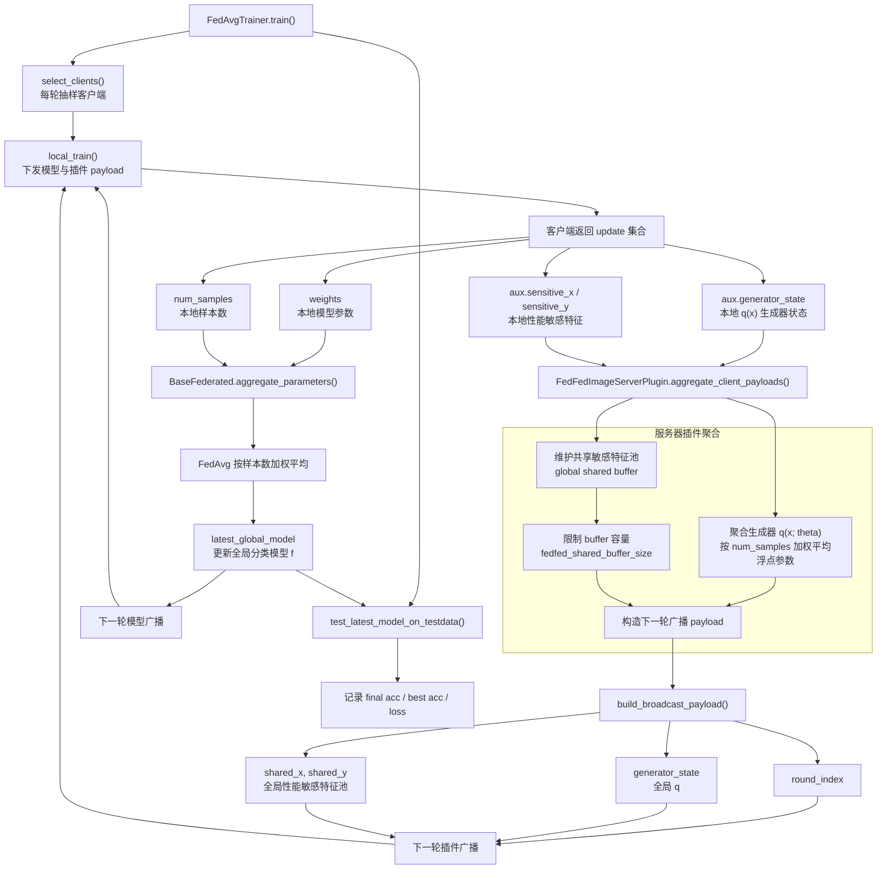

# FedFed Image Plugin Runtime Diagrams

## Client Runtime

```mermaid
flowchart TB
    A["BaseFederated.local_train()"] --> B["BaseClient.set_model_parameters()<br/>接收最新 FedAvg 全局模型"]
    A --> C["BaseClient.set_plugin_payload()<br/>接收服务器插件广播"]

    C --> D["FedFedImageClientPlugin.on_round_start()"]
    D --> D1["同步生成器 q(x; theta)<br/>generator_state"]
    D --> D2["载入共享敏感特征池<br/>shared_x, shared_y"]
    D --> D3["清空本轮上传缓存<br/>upload_x, upload_y"]

    B --> E["本地 DataLoader<br/>本地异构数据 (x, y)"]
    E --> F["FedFedImageClientPlugin.train_batch()"]

    subgraph G["客户端 batch 内部"]
        G1["主任务分类<br/>pred = f(x)<br/>L_local = CE(pred, y)"]
        G2["FedFed 特征分离<br/>x_r = q(x; theta)<br/>x_s = x - x_r"]
        G3["敏感特征可判别约束<br/>L_fd = CE(f(x_s), y)"]
        G4["敏感特征范数约束<br/>L_norm = mean(||x_s||^2)"]
        G5["共享特征辅助训练<br/>L_shared = CE(f(shared_x), shared_y)"]
        G6["联合优化<br/>L = L_local + lambda_fd L_fd<br/>+ lambda_norm L_norm + lambda_shared L_shared"]
    end

    F --> G1
    F --> G2
    G2 --> G3
    G2 --> G4
    D2 --> G5
    G1 --> G6
    G3 --> G6
    G4 --> G6
    G5 --> G6

    G6 --> H["optimizer.step()<br/>更新本地模型 f 与生成器 q"]
    G2 --> I["按类限量缓存 x_s<br/>fedfed_upload_per_class / per_client"]

    H --> J["BaseClient.get_model_parameters_cpu()<br/>上传 FedAvg 模型权重"]
    I --> K["build_upload_payload()"]
    H --> K
    K --> K1["generator_state"]
    K --> K2["sensitive_x, sensitive_y"]

    J --> L["客户端 update"]
    K1 --> L
    K2 --> L
    L --> M["返回服务器<br/>{weights, num_samples, aux}"]
```

## Server Runtime

```mermaid
flowchart TB
    A["FedAvgTrainer.train()"] --> B["select_clients()<br/>每轮抽样客户端"]
    B --> C["local_train()<br/>下发模型与插件 payload"]

    C --> D["客户端返回 update 集合"]
    D --> D1["weights<br/>本地模型参数"]
    D --> D2["num_samples<br/>本地样本数"]
    D --> D3["aux.generator_state<br/>本地 q(x) 生成器状态"]
    D --> D4["aux.sensitive_x / sensitive_y<br/>本地性能敏感特征"]

    D1 --> E["BaseFederated.aggregate_parameters()"]
    D2 --> E
    E --> E1["FedAvg 按样本数加权平均"]
    E1 --> E2["latest_global_model<br/>更新全局分类模型 f"]

    D3 --> F["FedFedImageServerPlugin.aggregate_client_payloads()"]
    D4 --> F

    subgraph G["服务器插件聚合"]
        G1["聚合生成器 q(x; theta)<br/>按 num_samples 加权平均浮点参数"]
        G2["维护共享敏感特征池<br/>global shared buffer"]
        G3["限制 buffer 容量<br/>fedfed_shared_buffer_size"]
        G4["构造下一轮广播 payload"]
    end

    F --> G1
    F --> G2
    G2 --> G3
    G1 --> G4
    G3 --> G4

    G4 --> H["build_broadcast_payload()"]
    H --> H1["round_index"]
    H --> H2["generator_state<br/>全局 q"]
    H --> H3["shared_x, shared_y<br/>全局性能敏感特征池"]

    E2 --> I["下一轮模型广播"]
    H1 --> J["下一轮插件广播"]
    H2 --> J
    H3 --> J

    I --> C
    J --> C

    A --> K["test_latest_model_on_testdata()"]
    K --> K1["记录 final acc / best acc / loss"]
    E2 --> K
```
