# 系统图：即插即用联邦学习特征蒸馏框架

下面这张图基于当前项目代码实现与《中期报告》第二部分已完成模块整理，重点体现每个功能模块所在位置、输入输出关系及其在联邦训练闭环中的作用。

```mermaid
flowchart LR
    A["入口层<br/>main.py / options.py<br/>读取实验配置与超参数"] --> B["数据与异构性构造层<br/>GetDataSet + utils/tools.py"]
    B --> B1["数据集加载<br/>MNIST / train / test"]
    B --> B2["标签/数量异构<br/>Dirichlet 划分<br/>get_each_client_data_index()"]
    B --> B3["特征异构<br/>build_client_feature_skews()<br/>apply_feature_skew()"]
    B --> B4["最小样本约束与重试机制<br/>避免极端划分导致训练失稳"]

    A --> C["联邦训练主干层<br/>FedAvgTrainer / BaseFederated"]
    B1 --> C
    B2 --> C
    B3 --> C
    B4 --> C

    C --> C1["客户端采样<br/>select_clients()"]
    C --> C2["全局模型广播<br/>latest_global_model"]
    C --> C3["本地训练调度<br/>local_train()"]
    C --> C4["服务端参数聚合<br/>aggregate_parameters()"]
    C --> C5["全局测试与指标记录<br/>metrics / plotting"]

    C2 --> D
    C3 --> D

    subgraph D["客户端执行层<br/>BaseClient + 本地数据 + 本地模型"]
        D1["本地 CNN 主模型<br/>mnist_cnn.py<br/>输出 logits 与中间特征 h"]
        D2["插件植入点 1<br/>on_round_start()<br/>接收服务端广播信息"]
        D3["插件植入点 2<br/>train_batch()<br/>替换默认 batch 训练逻辑"]
        D4["插件植入点 3<br/>build_upload_payload()<br/>上传附加信息"]
    end

    D --> E

    subgraph E["客户端插件模块<br/>FedFedClientPlugin"]
        E1["中间特征低维投影模块<br/>FeatureSplitModule<br/>h -> z_s"]
        E2["按类别原型提取<br/>对 batch / 本地数据累积 prototype"]
        E3["隐私风险缓解与稳定性增强<br/>原型归一化 + 裁剪 + 高斯噪声"]
        E4["特征蒸馏损失<br/>本地 prototype 对齐全局 prototype"]
        E5["特征锚定约束<br/>限制本地表示偏离轮初参考模型"]
        E6["联合优化机制<br/>L = L_cls + λ_distill L_distill + λ_anchor L_anchor"]
    end

    E1 --> E2
    E2 --> E3
    E3 --> F
    E4 --> E6
    E5 --> E6

    C4 --> G

    subgraph G["服务端插件模块<br/>FedFedServerPlugin"]
        G1["聚合客户端附加信息<br/>aggregate_client_payloads()"]
        G2["聚合投影层状态<br/>projection_state 加权平均"]
        G3["聚合类别原型<br/>按类、按样本数加权"]
        G4["全局原型更新<br/>支持 momentum 平滑"]
        G5["广播辅助信息<br/>build_broadcast_payload()"]
    end

    F["客户端上传 payload<br/>projection_state + prototypes + count"] --> G1
    G1 --> G2
    G1 --> G3
    G3 --> G4
    G2 --> G5
    G4 --> G5
    G5 --> D2

    C4 --> H["FedAvg 参数聚合结果<br/>更新全局模型参数"]
    H --> C2
    E6 --> D4
```

## 图中模块对应关系

1. **经典联邦学习闭环主干**
   `main.py` 负责组装配置、数据和训练器；`src/fed_server/fedavg.py` 与 `src/fed_server/fedbase.py` 负责客户端采样、模型下发、参数聚合、全局评估，构成标准 FedAvg 主干。

2. **多种数据异构场景模拟**
   `src/utils/tools.py` 中的 `get_each_client_data_index()`、`_build_dirichlet_partition()`、`build_client_feature_skews()`、`apply_feature_skew()` 分别对应标签偏斜、数量偏斜、特征偏斜以及重试机制。

3. **中间特征低维投影模块**
   `src/plugins/feature_split.py` 中 `FeatureSplitModule` 将主模型中间特征 `h` 映射为低维敏感表示 `z_s`，作为原型提取与蒸馏的统一输入。

4. **隐私风险缓解与稳定性增强机制**
   `src/plugins/fedfed_plugin.py` 中 `_clip_and_noise()` 对本地类别原型执行裁剪与加噪，在共享前降低异常幅值影响并缓解隐私泄露风险。

5. **按类别原型提取、聚合与广播机制**
   客户端在 `FedFedClientPlugin` 中累积本地类别原型；服务端在 `FedFedServerPlugin` 中按样本数加权聚合，并形成下一轮广播的全局类别原型。

6. **基于特征空间的蒸馏机制**
   `FedFedClientPlugin._compute_prototype_distill_loss()` 使用本地原型与服务端广播原型之间的距离构造蒸馏损失，缓解 Non-IID 条件下的客户端漂移。

7. **分类损失与蒸馏损失联合优化**
   `FedFedClientPlugin.train_batch()` 中以分类损失为主任务目标，再叠加蒸馏损失与特征锚定损失，形成联合训练目标。

8. **模块化插件式扩展机制**
   `src/plugins/base.py` 定义插件协议，`src/plugins/__init__.py` 负责注册表、插件名解析和工厂构建，使蒸馏模块以“可插拔组件”方式嵌入联邦主干。

## 适合放在报告中的一句图注

“系统以 FedAvg 主干为基础，在客户端与服务端关键节点植入 FedFed 插件，实现了异构数据模拟、低维特征投影、类别原型共享、隐私增强处理和特征蒸馏联合优化的可插拔联邦学习闭环。”
